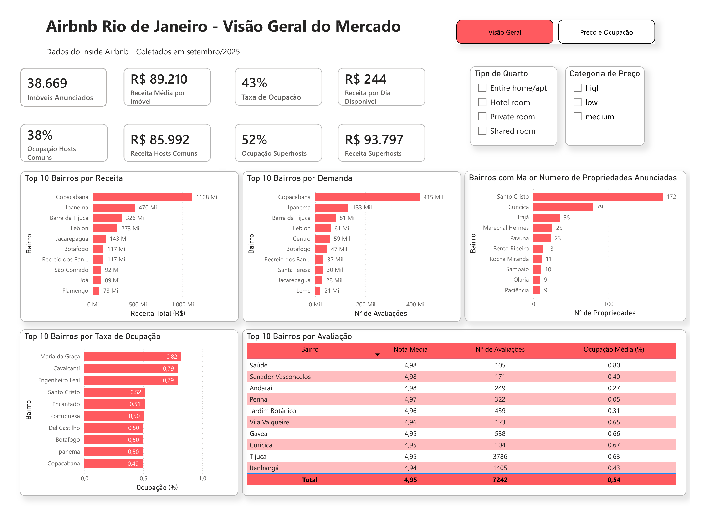
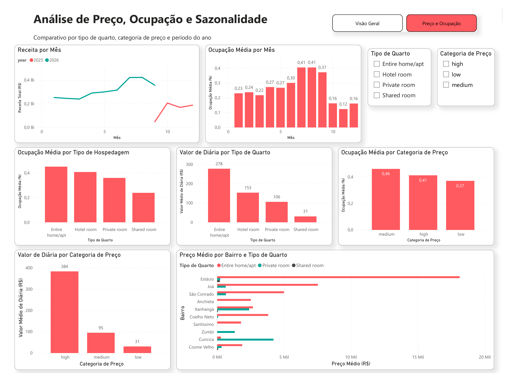

# 🏠 Airbnb Analytics — Rio de Janeiro

Pipeline de dados completo com análise do mercado de aluguéis de curta temporada no Rio de Janeiro, utilizando dados públicos do [Inside Airbnb](https://insideairbnb.com/).

---

## 📊 Dashboard

### Página 1 — Visão Geral do Mercado



### Página 2 — Análise de Preço, Ocupação e Sazonalidade



---

## 🎯 Objetivo

Transformar dados brutos do Airbnb em insights acionáveis sobre ocupação, precificação e sazonalidade do mercado carioca, seguindo boas práticas de engenharia de dados — da ingestão à visualização.

---

## 🛠️ Stack Tecnológico

| Ferramenta | Uso |
|---|---|
| **BigQuery** | Data Warehouse — armazenamento e processamento dos dados |
| **dbt Cloud** | Transformação, modelagem e testes de qualidade |
| **Power BI** | Visualização e dashboards interativos |
| **GitHub** | Versionamento do código |

---

## 📐 Arquitetura do Pipeline

```
Inside Airbnb (CSV)
        ↓
  BigQuery Raw
  (airbnb_raw)
        ↓
   Staging Layer
  ┌─────────────────┐
  │  stg_listings   │  → limpeza, tipagem e filtros
  │  stg_calendar   │  → padronização de campos
  └─────────────────┘
        ↓
 Intermediate Layer
  ┌─────────────────┐
  │  int_listings   │  → categorização de preço e tamanho
  │  int_calendar   │  → métricas de ocupação e receita
  └─────────────────┘
        ↓
    Marts Layer
  ┌───────────────────────┐
  │  mart_listings_full   │  → tabela principal (listing + ocupação)
  │  mart_seasonality     │  → sazonalidade por mês e bairro
  │  mart_listings_summary│ → resumo por bairro e tipo de quarto
  └───────────────────────┘
        ↓
     Power BI
   (Dashboards)
```

---

## 📊 Modelos dbt

### Staging
- **`stg_listings`** — dados de imóveis limpos e tipados, com filtro de preços nulos/inválidos
- **`stg_calendar`** — disponibilidade por dia de cada listing

### Intermediate
- **`int_listings`** — adiciona categorização de preço (`low/medium/high`) e capacidade (`small/medium/large`)
- **`int_calendar`** — calcula `revenue_realized`, `revenue_potential`, `is_booked` e flag de fim de semana, com preço derivado do listing associado

### Marts
- **`mart_listings_full`** — tabela desnormalizada com características do imóvel + métricas de ocupação e receita; base principal do Power BI
- **`mart_seasonality`** — análise de sazonalidade por ano, mês, bairro e tipo de quarto
- **`mart_listings_summary`** — agregado por bairro e tipo de quarto com preço médio e avaliações

---

## 💡 Principais Insights

**Mercado geral**
- O mercado conta com **38.669 imóveis** ativos no Rio de Janeiro, com ocupação média de **43%** e RevPAR (receita por dia disponível) de **R$ 244**.

**Superhosts vs. Hosts comuns**
- Superhosts têm **37% mais ocupação** (52% vs. 38%) e **9% mais receita média** que hosts comuns — o status de Superhost está diretamente associado a melhor performance no mercado.

**Receita e demanda por bairro**
- **Copacabana** concentra a maior receita e o maior volume de avaliações do mercado, seguido por **Ipanema** e **Barra da Tijuca** — bairros litorâneos tradicionais ainda dominam o volume financeiro.
- Bairros com **maior número de imóveis cadastrados** (Santo Cristo, Curicica, Irajá) são diferentes dos bairros líderes em receita — sinal de que oferta e demanda não estão geograficamente alinhadas.

**Avaliação**
- Entre bairros com volume relevante de avaliações (100+), **Saúde, Senador Vasconcelos e Andaraí** lideram em nota média — bairros menos turísticos competem de igual para igual com as zonas mais conhecidas em qualidade de hospedagem.

**Sazonalidade**
- A receita e a ocupação apresentam forte padrão sazonal, com pico entre **julho e agosto** — alta temporada no Rio de Janeiro.

**Preço, tipo de quarto e rentabilidade**
- **Entire home/apt** lidera tanto em ocupação quanto em RevPAR — é o produto mais forte do mercado.
- Imóveis na categoria de preço **"high"** têm o maior RevPAR mesmo com ocupação ligeiramente menor que as categorias mais baratas — o preço mais alto compensa a menor taxa de ocupação.
- Bairros como **Joá** e **São Conrado** apresentam os maiores tickets médios, refletindo o perfil de imóveis de alto padrão dessas regiões.

---

## ✅ Qualidade de Dados

Testes implementados com dbt:
- `unique` e `not_null` nos campos-chave
- `accepted_values` para `room_type`
- Filtro de listings sem preço definido na camada de staging
- Tratamento de outliers (ex: imóveis cadastrados incorretamente como "Shared room" com preços incompatíveis com a categoria)

---

## 📁 Estrutura do Repositório

```
airbnb-dbt/
├── models/
│   ├── staging/
│   │   ├── sources.yml
│   │   ├── schema.yml
│   │   ├── stg_listings.sql
│   │   └── stg_calendar.sql
│   ├── intermediate/
│   │   ├── int_listings.sql
│   │   └── int_calendar.sql
│   └── marts/
│       ├── schema.yml
│       ├── mart_listings_full.sql
│       ├── mart_listings_summary.sql
│       ├── mart_calendar.sql
│       └── mart_seasonality.sql
├── analyses/
├── macros/
├── seeds/
├── images/
│   ├── dashboard_visao_geral.png
│   └── dashboard_preco_ocupacao.png
├── Airbnb_v1.pbix
└── dbt_project.yml
```

---

## 🚀 Como Reproduzir

### Pré-requisitos
- Conta no [dbt Cloud](https://cloud.getdbt.com/)
- Projeto no [Google BigQuery](https://cloud.google.com/bigquery)
- Dados do [Inside Airbnb — Rio de Janeiro](https://insideairbnb.com/get-the-data/)

### Passos
1. Faça upload dos arquivos `listings.csv` e `calendar.csv` no BigQuery (dataset: `airbnb_raw`)
2. Clone este repositório e conecte ao dbt Cloud
3. Configure o `profiles.yml` com suas credenciais do BigQuery
4. Execute o pipeline completo:

```bash
dbt build
```

5. Abra o arquivo `Airbnb_v1.pbix` no Power BI Desktop e conecte ao seu projeto BigQuery

> **Nota:** ao conectar o Power BI ao BigQuery, garanta que o dataset esteja na mesma região configurada nas opções de conexão (ex: `US` ou `southamerica-east1`) — discrepâncias de localidade impedem a conexão.

---

## 📌 Fonte dos Dados

Dados públicos disponibilizados pelo [Inside Airbnb](https://insideairbnb.com/get-the-data/), coletados da plataforma Airbnb para a cidade do **Rio de Janeiro, Brasil** (coleta de setembro/2025).

---

## 👤 Autor

**Diego Diez Garcia**
[GitHub](https://github.com/diegodzgarcia)
